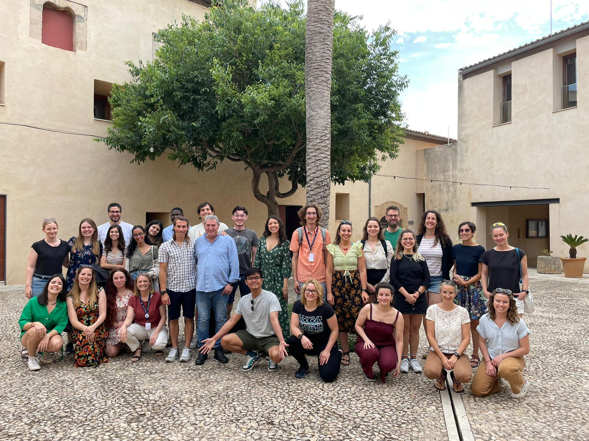
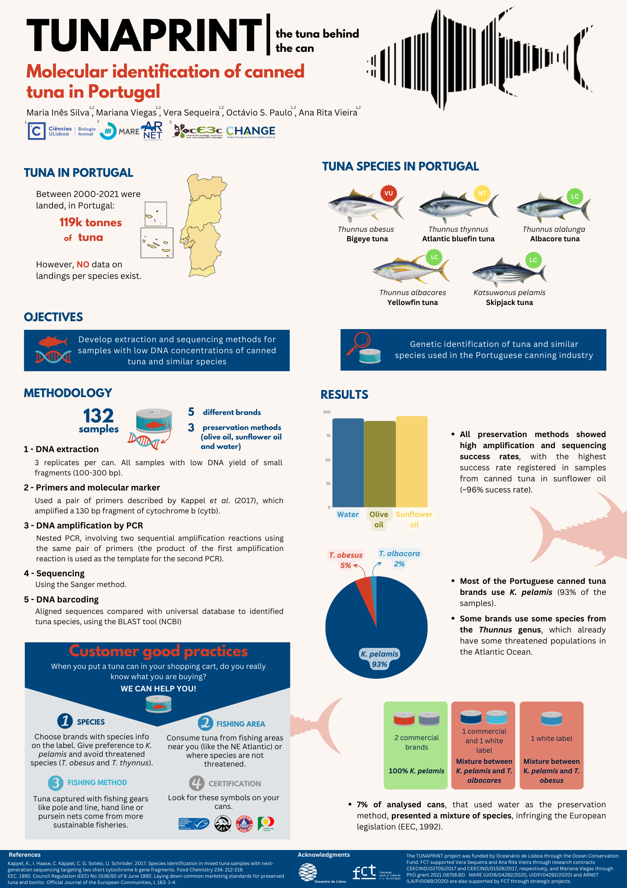
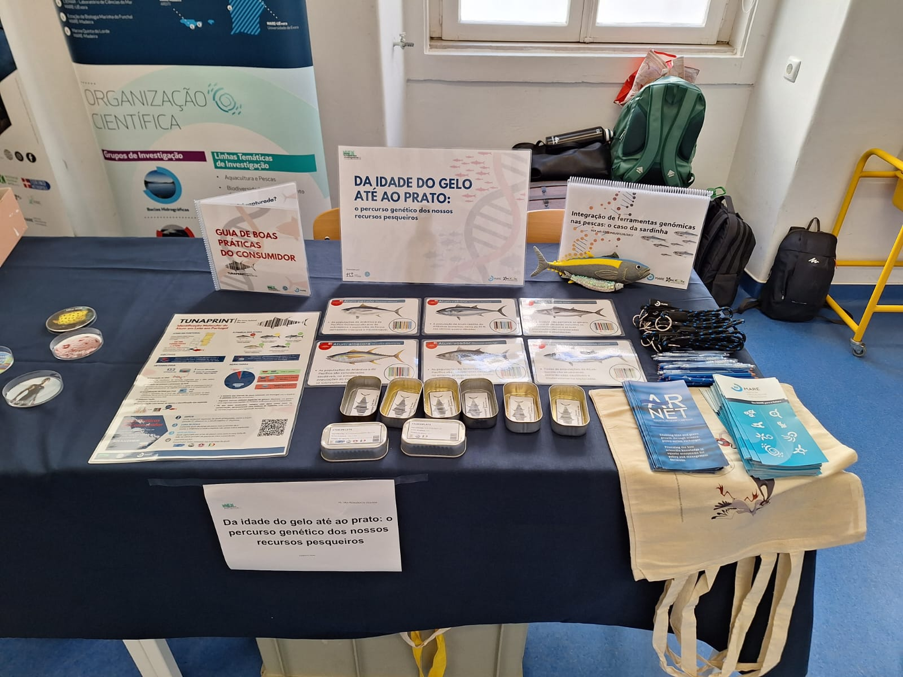
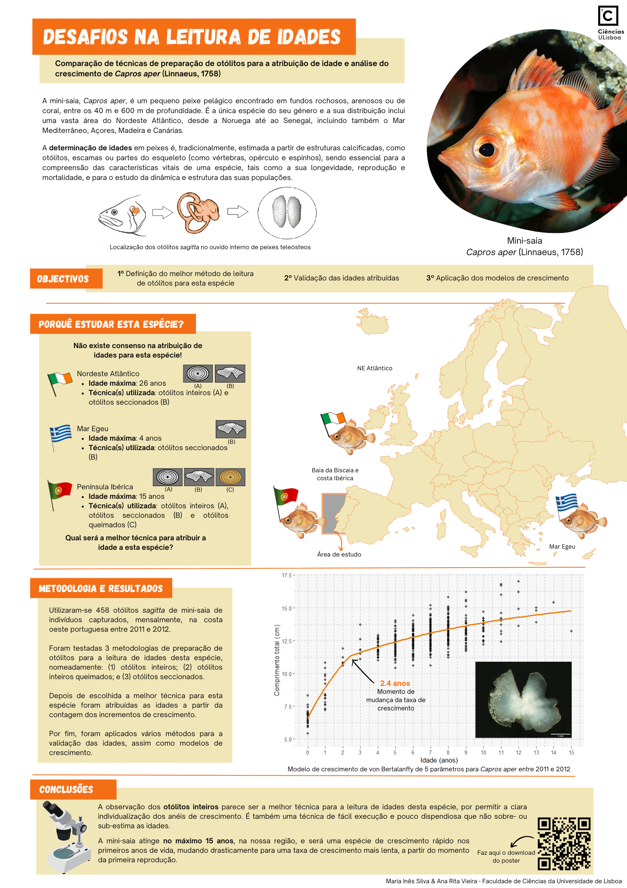

# Fisheries biologist

## Who am I?

I graduated in Environmental Biology with a specialization in Marine Biology from the Faculty of Science at the University of Lisbon (FCUL), and I have recently obtained my master's degree in Marine Ecology at the same university. I am fascinated by Fisheries Biology and believe it's crucial to connect scientific findings with our everyday world in an accessible and straightforward manner for everyone. I am very enthusiastic, positive and always eager to learn more, detail-oriented, motivated, and creative in any task assigned. I am capable of conducting both laboratory and fieldwork and work well in a team as well as under pressure. I also have training as Environmental Educator.

### Education

**Marine Ecology, MSc**
- Faculty of Sciences of the University of Lisbon (FCUL)
- Dissertation on Fish Age and Growth: "Struggling with fish age: a comparison of otolith preparation techniques to unravel age and growth of boarfish, _Capros aper_ (Linnaeus, 1758)" 

**Environmental Biology (Marine Variant), BSc**
- Faculty of Sciences of the University of Lisbon (FCUL)

## What have I been up to?

### Projects

**VALORSUL Monitoring Program - CTRSU de S. João da Talha | 2022-Today | Provision of services**
- Colaborator on the Monitoring Program of Terrestrial and Estuarine ecossistems surrounding a Solid Waste Treatment Plant in Lisbon (CTRSU de S. João da Talha)
- Conducted data collection, processing, and analysis on macroinvertebrates an ichthyofauna
- Produced the Annual Monitoring Report 

**InterDIS Summer School 2.0 2024**
- Part of the Organizing Committee for the 2nd edition of the da “Summer school for Interdisciplinary Ocean transformation”, with ICES Strategic Initiative on the Integration of Early Career Scientists (SIIECS) for 2024
- Reviewing of the evaluation report on the 1st edition of InterDIS 2023
- Reviewing of the funding proposal

- Check out a video on the 1st SIIECS Oyster InterDis Summer School 2023 [here](https://www.youtube.com/watch?v=_x5efq0URrU)

**Project "Distance between replicates for studying Foraminifera in recent tropical and temperate estuarine environments: methodology and experimental design" | FCUL | December 2019**
- Sample preparation and analysis, species identification, sorting and counting of foraminifera individuals/species
- Suppervision: Professors Décio Semensatto and Francisco Fatela

### Outputs

#### Posters and Science Communication Material

**Ciências Research & Innovation Day | FCUL | October 2023**

TUNAPRINT: Molecular identification of canned tuna in Portugal from the project TUNAPRINT|the tuna behind the can

**European Researcher's Night 2023 | "Science for All - Sustainability and Inclusion" | September 2023**

From the Ice Age to the plate: the genetic journey of our fishery resources

Such a great experience! On the last friday night of September we were at the National Museum of Natural History and Science sharing the TUNAPRINT project results. We designed a quick and fun game to show what COULD really be inside our tuna cans. Check out our poster and dissemination materials bellow.

[poster](images/poster A2 NEI23 - TUNAPRINT.png)
- You can also download our Canned Tuna Consummer's Guide (Pt) [here](https://drive.google.com/uc?export=download&id=15LWc91HtDBjv3dY4EALzFE1DBkIkWtwW)

**Ciências Open Day 2023 | May 2023**

Struggling with fish age: a comparison of otolith preparation techniques to unravel age and growth of boarfish, _Capros aper_ (Linnaeus, 1758)"

You can read more about it [here](https://www.mare-centre.pt/pt/especies-do-mare-encantam-no-dia-aberto-da-fcul)

#### Reports
**Annual Report 2023 - Monitoring Program of Terrestrial and Estuarine Ecossystems surrounding S. João da Talha Solid Waste Treatment Plant**
- Brotas V., Sim-Sim M., Vieira A.R., Caçador I., Duarte B., Gordo L.S., Martins A., Silva M.I., Tracana A. & Veloso V. 2023. Programa de Monitorização dos ecossistemas terrestre e estuarino na envolvente à CTRSU de S. João da Talha – Relatório Anual de 2023. Dezembro de 2023, 110 p. + Anexos.

**Annual Report 2022 - Monitoring Program of Terrestrial and Estuarine Ecossystems surrounding S. João da Talha Solid Waste Treatment Plant**
- Vieira A.R., Brotas V., Sim-Sim M., Caçador I., Duarte B., Garcia C., Gordo L.S., Martins A., Silva M.I., Tracana A. & Veloso V. 2022. Programa de Monitorização dos ecossistemas terrestre e estuarino na envolvente à CTRSU de S. João da Talha – Relatório Anual de 2022. Dezembro de 2022, 105 p. + Anexos.

