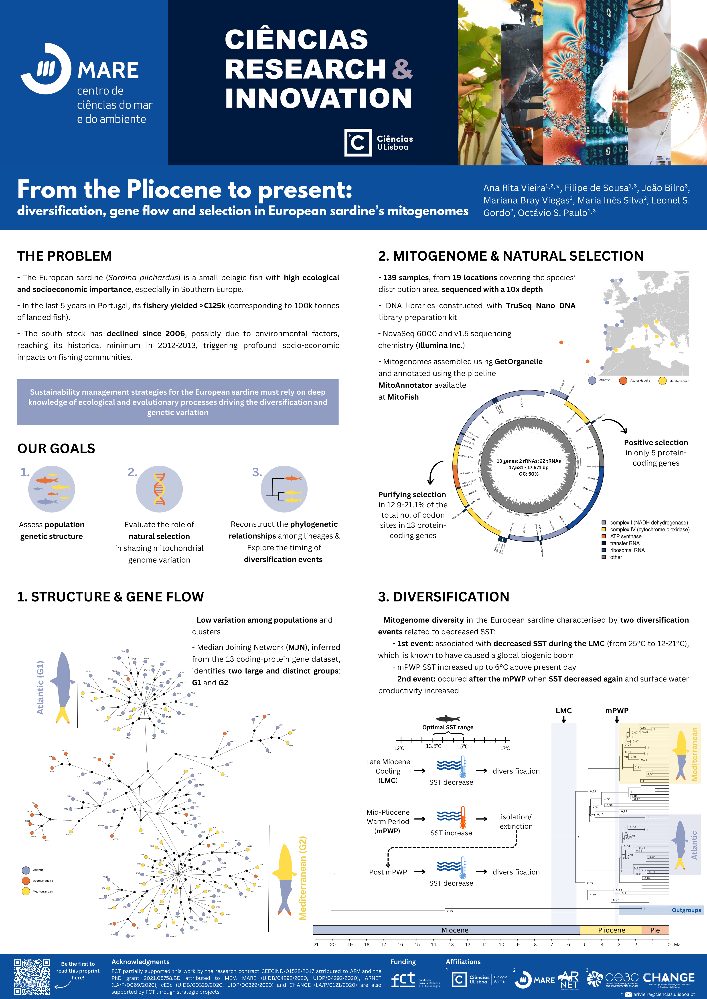
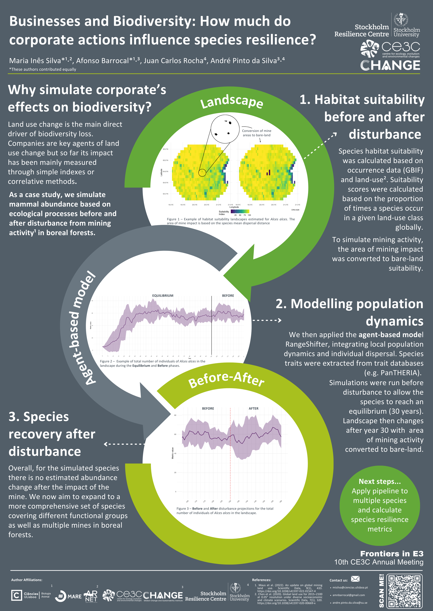
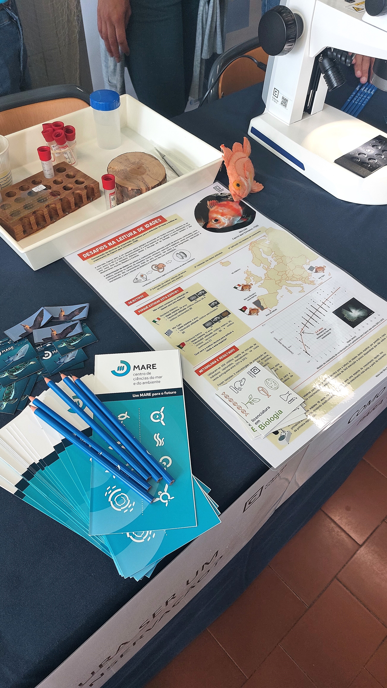

# Fisheries biologist

# About me

I am an Environmental Biologist with a deep-rooted passion for Fisheries Biology and a specialization in Marine Ecology. 

My passion lies in understanding fish life-history strategies, accurate data collection and the application of statistical modeling to address pressing challenges in fisheries science. I am also particularly driven by the need to bridge scientific findings with real-world applications, ensuring that  our research informs sustainable fisheries management and conservation efforts in accessible and impactful ways. Currently, I am a Research Collaborator at MARE-ULisboa (Marine and Environmental Sciences Centre), where I work with the Fisheries Biology Lab on fish life-history and genetics projects. But beyond the aquatic world, I also venture into terrestrial systems, collaborating with the SRIT and BLIZ teams from the SRC (Stockholm Resilience Centre) on population dynamics models for mammals and plants. 

I thrive in team settings, bringing motivation, creativity, and a meticulous eye for detail to every project. I also have some experience in Environmental Education, which has been reinforced by my commitment to making science accessible and impactful for different audiences.

**My ultimate goal?  Contribute to fisheries research that not only advances our understanding of aquatic ecosystems but also drives solutions for their sustainable management.**

# Education

**PhD student in Biology and Ecology of Global Changes**
- Faculty of Sciences of the University of Lisbon (FCUL) & Liverpool John Moores University
- Research project: "Water has memory: eDNA as a new tool to assess purse-seine fisheries discards"

**MSc in Marine Ecology**
- Faculty of Sciences of the University of Lisbon (FCUL)
- Dissertation: "Struggling with fish age: a comparison of otolith preparation techniques to unravel age and growth of boarfish, _Capros aper_ (Linnaeus, 1758)"
- Focus: Fish age estimation, growth dynamics and otolith preparation techniques

**BSc in Environmental Biology**
- Faculty of Sciences of the University of Lisbon (FCUL)
- Specialization: Marine Biology

# What have I been up to?

## **Projects**

**SRIT - Development of a Species Resilence Impact Tool | 2024-Present**
- Focus Area: Terrestrial Ecology & Data Management
- Part of the [FinBio](https://finbio.org/) Project, financed by [MISTRA](https://mistra.org/#eng) and hosted at the Stockholm Resilience Centre.
- Led data collection, extraction, and compilation tasks for terrestrial mammals’ life-history traits from multiple databases, to serve as input for the RangeShifter model.
- Created species suitability landscapes and mine impact landscapes to assess resilience under disturbance scenarios.
- Calculated species resilience and community metrics, integrating these into actionable conservation models.
- Processed and analyzed spatial data to support model development and improve predictive accuracy.

Athough we did not make it in the final round this project has been the Country Winner for Sweden in the global “T4PF - Capgemini”.

**BLIZ - Interactions between society, land use, ecosystem services and biodiversity in Bavaria until 2100 | 2024-Present** 
- Focus Area: Data Visualization, Biodiversity Modeling & Sensitivity Analysis
- [Subproject 2: Biodiversity Tipping Points in Climate and Land Use Change](https://bayklif-bliz.de/sub-projects/sub-project-2-biodiversity-tipping-points-in-climate-and-land-use-change/), funded by the climate research network [Bayklif](https://www.bayklif.de/), an initiative of the Bavarian State Ministry of Science and the Arts.
- Data visualization for species distribution model outputs (MetaRange) using R
- Conducted spatial data manipulation, created population- and individual-level plots, and performed sensitivity analyses.
Proficient in the ggplot and raster packages for high-quality visualization and analysis

Check our scripts and data in the [github repository](https://github.com/andrepsilvadev/GermanGrasslandPlants)

**TUNAPRINT: The tuna behind the can | 2022-2023**
- Focus Area: Marine Genetics & Science Communication
- Participated in sampling events, DNA extraction, and PCR analysis for tuna traceability research.
- Created educational materials, including a card game, a canned tuna consumer's guide, and a results summary poster, to disseminate project findings to both scientific and public audiences. Check below for the materials!!

**VALORSUL Monitoring Program - CTRSU de S. João da Talha | 2022-Today | Provision of services**
- Focus Area: Environmental Monitoring & Ecosystem Assessment
- Colaborator on the Monitoring Program of Terrestrial and Estuarine ecossistems surrounding a Solid Waste Treatment Plant in Lisbon (CTRSU de S. João da Talha)
- Conducted data collection, processing, and analysis on macroinvertebrates an ichthyofauna
- Produced the Annual Monitoring Report, providing actionable insights ecossytem status

**InterDIS Summer School 2.0**
- Part of the Organizing Committee for the 2nd edition of the da “Summer school for Interdisciplinary Ocean transformation”, with ICES Strategic Initiative on the Integration of Early Career Scientists (SIIECS) for 2024
- Contributed to the review of the evaluation report on the 1st edition of InterDIS (2023) to assess its outcomes and refine future iterations.
- Reviewing of the funding proposal

- Check out a video on the 1st SIIECS Oyster InterDis Summer School 2023 [here](https://www.youtube.com/watch?v=_x5efq0URrU)

**Project "Distance between replicates for studying Foraminifera in recent tropical and temperate estuarine environments: methodology and experimental design" | FCUL | December 2019**
- Focus Area: Microfossil Analysis & Experimental Design
- Conducted sample preparation, species identification, sorting, and counting of foraminifera individuals and species to support research

## Outputs

### Publications

Struggling with Fish Age: A Comparative Analysis of Otolith Preparation Techniques to Unravel Age and Growth of Boarfish, Capros Aper (Linnaeus, 1758). _Silva, Maria Inês and Martins, Rui and Sequeira, Vera and Silva, Dina and Farias, Inês and Assis, Carlos A. and Gordo, Leonel Serrano and Vieira, Ana Rita_. Available at [https://www.nature.com/articles/s41598-024-71209-5](https://www.nature.com/articles/s41598-024-71209-5)

> **Stay tuned—there’s more science in the pipeline!**

### Conference communications

> **Turning the tables: Can boarfish become the next sustainable fishery for the Portuguese coast?** - X Iberian Congress of Ichthyology, Vic, Spain, June 2024

> **Unlocking potential: Leveraging no-value bycatch species into new opportunities** - X Iberian Congress of Ichthyology, Vic, Spain, June 2024

### Conference Posters

> **From the Pliocene to present: diversification, gene flow and selection in European sardine’s mitogenomes**

Presented at the 2024 Ciencias Research & Innovation Day

> **Estimation of corporate’s effects on species abundance based on ecological processes**

Presented at the 20th Conference on Complex Systems (CCS2024) at the University of Exeter (UK)

> **TUNAPRINT: Molecular identification of canned tuna in Portugal**

Presented at the 2023 Ciencias Research & Innovation Day

### Outreach & Science Communication 

Engaging with the public and sharing science is one my favorite parts of my work. See below how some of those activities have allowed me to connect with different audiences, communicate complex concepts in an accessible way, and inspire curiosity about fisheries biology and our oceans' sustainability.

> **MSc and PhD Day in Sciences 2023**

At this event, I had the opportunity to meet prospective students, showcasing FCUL’s graduate programs and sharing insights into the MSc in Marine Ecology. It was rewarding to discuss academic pathways and inspire others to dive into marine research.

> **Ciências Open Day 2023**

As part of this event, I led public engagement activities to disseminate research results from my MSc dissertation, "Struggling with Fish Age: A Comparison of Otolith Preparation Techniques to Unravel Age and Growth of Boarfish, Capros aper." Visitors learned how otoliths can reveal fascinating insights into fish age and growth.

You can read more about this day [here](https://www.mare-centre.pt/pt/especies-do-mare-encantam-no-dia-aberto-da-fcul)

> **24th Pavilion of Knowledge “Centro de Ciência Viva” Anniversary**

I participated in public engagement activities for this exciting event, which welcomed over 5,000 participants of all ages. My science communication focused on fish age and growth, using biological materials like otoliths, cleithra, vertebrae, and opercula to explain the tools we use in fisheries research.

You can learn more about how it all went down [here](https://www.pavconhecimento.pt/24aniversario)!

> **European Researcher's Night 2023 "Science for All - Sustainability and Inclusion"**

From the Ice Age to the plate: the genetic journey of our fishery resources
It was an incredible experience to participate in this event at the National Museum of Natural History and Science! Representing the TUNAPRINT project, we designed an interactive game to highlight what could really be inside our tuna cans. Visitors explored the science behind DNA analysis and traceability, linking sustainability and fisheries research.

Check out the dissemination materials:

- [Poster](images/poster A2 NEI23 - TUNAPRINT.png)
- [Canned Tuna Consummer's Guide (Pt)](https://drive.google.com/uc?export=download&id=15LWc91HtDBjv3dY4EALzFE1DBkIkWtwW)

